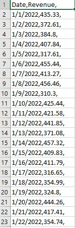
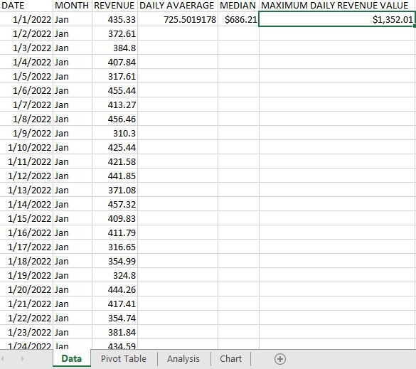
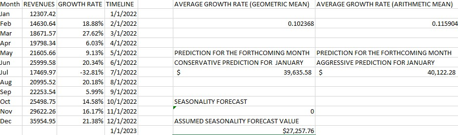
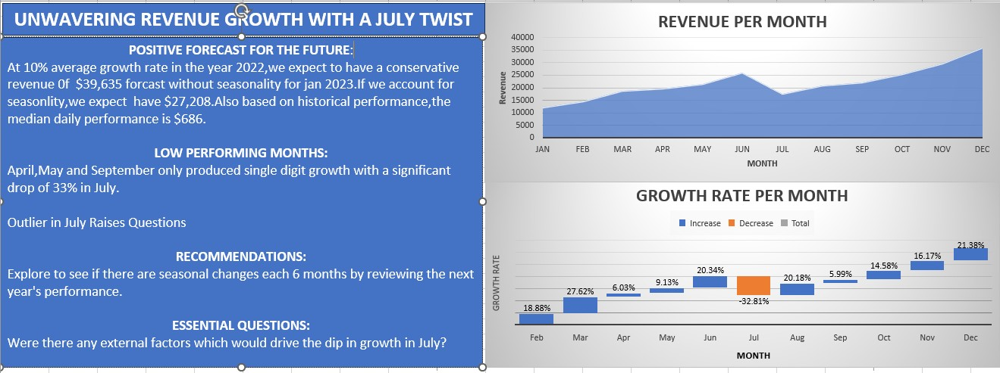

# MICROSOFT-EXCEL-BUSINESS-REVENUE-ANALYSIS-AND-FORECAST

## BUSINESS REVENUE ANALYSIS FOR THE YEAR 2022 AND FORECASTING PROJECT
The Revenue Analysis of a business provides a view on the income generated by a business over the course of operation either monthly or yearly.

## MAIN OBJECTIVE
The primary goal of this project is to provide an understanding of past revenue performance and forecast future revenue.The client is looking to gain insightss that will inform strategic decisions for the upcoming quarter.

## PROBLEM STATEMENTS:
1.What is the revenue trends. 
2.What is the average monthly revenue. 
3.what is the monthly growth rates. 
4.What is the predictions for the coming month based on these rates. 
5.Visualise your findings. 

## IMPORTANT TRENDS
1.Revenue Growth. 
2.Seasonality. 
3.Month to month fluctuations. 
4.Outliers. 
5.Growth Rate Trend. 
6.Revenue concentration. 

Some statistical concepts that will be used in this project are; 
### ARITHMETIC MEAN:
This is the simplest and most widely used measure of a mean or average.It simply involves taking the sum of a group of numbers,then dividing that sum by the count of the numbers used in the series.For example in a series of numbers where we have 3,2,6 the arithmetic mean can be gotten by 3+2+6/3 = 6.

__WHEN TO USE IT: Use it when dealing with raw data.__ 
__WHY USE IT: To find the average value in a dataset.__ 
__EXAMPLE: Calculating average monthly revenue.__ 

### GEOMETRIC MEAN:
This is the average value or mean which signifies the central tendency of the set of numbers by taking the root of the product of their values.For example in a set of numbers of 3,2,6 the geometric mean is 3*2*6=36,the root of 36 is 6 which is the geometric mean. 

__WHEN TO USE IT: Use it when dealing with rates or multiplicative data,like growth rate.__ 
__WHY USE IT: To find the average rate of growth considering compounding.__ 
__EXAMPLE: Calculating average compounding monthly growth rate.__

### MEDIAN:
A median is the value separating the higher half from the lower half of a data sample,population or a probability distribution.Most at times it may be thought of as the 'middle'value.

### GROWTH RATE:
Growth rate measures the changes of a value from one period to another which can be monthly,quarterly or yearly.it is generally expressed as a percentage.

## DATA CLEAN UP PROCESS:
Clean up the dataset by splitting the merged date and revenue column into two separate columns by using the "text to column" option and using "," as the delimiter.

Raw dataset                                 |                Cleaned dataset
:-----------------------------------------: | :-----------------------------------------:
                        |    

## DATA ANALYSIS PROCESS:
The dataset consists of two columns,the 'Date' column which consists of the day dates of each month and the 'Revenue' column consisting of income or revenue of the day. The following steps were carried out; 
1. Grouping the data using a pivot table by month and getting the sum total of revenue for each month. 
2. Get the growth rate for each month starting from the second month as there is no data before the first month. 
3. Get the average growth rate using geometric mean and not arithmetic mean due to consideration in revenue compounding. 
4. Carry out Forecasting, conservative and aggressive  for the forthcoming month,in this case january. 
5. Visualise and interpret the findings. 

# METRICS
## Average growth rate:
Growth rate formula = current month revenue-previous month revenue/previous month revenue.
Geometric mean is used to take the "average growth rate" due to compounding of the growth rate.It will be wrong to take the average growth rate using arithmetic mean as it only takes the average,not considering compounding of the growth rate.Using geometric mean to get the "average growth rate" means it must not give a negative value,hence a value of 1 is added to the growth rate value within the brackets and subtract it outside with a -1 to get a more conservative value.

## Forecasting:
Prediction values for the next year january revenue's were done for conservative forecasted revenue projection and aggressive forecasted revenue projection.The "average growth rate" used in each of the projection was the one gotten from our geometric mean and not the arithmetic mean.

#### conservative projection formula:
january Prediction = previous year december revenue * 1 + average growth rate(geometric mean)

#### aggressive projection formula:
january Prediction = previous year december revenue * 1 + F#

## Seasonality:
This refers to periodic fluctuations in certain business areas,and cycles that occur regularly based on a particular season.This is a characteristic of a time series in which the data experiences regular and predictable changes that recur every calender year. Since there wasn't any previous data with the current data to check for Seasonality.Assumptions were made.

#### OUTLIERS
The average is going to be affected by outliers or high value.

## Chart and Findings

